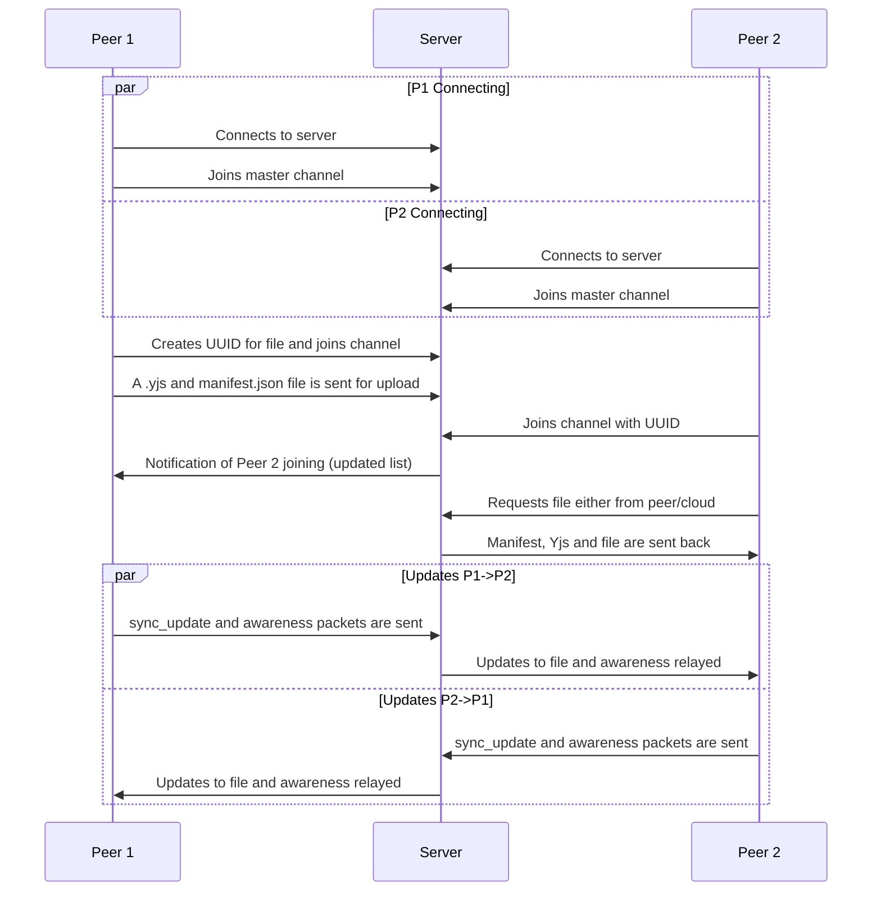

# Operation Vault
Operation Vault (OV, OpVault) consists of three major components: an Obsidian client, web client and relay server. Both the web client and relay server are meant to be self-hostable, while the Obsidian will work after installation. The plugin must work in conjunction with the relay server.

The objective is to transform an Obsidian vault into something that has similar “cloud” capabilities to Google Docs. This means quick generation of links with minimal setup required on both ends of a connection. Oh, and did I mention that this will be (mostly) peer to peer? And end-to-end encrypted?
## Capabilities
### Multiplayer
OpVault will utilise a relayed P2P (peer-to-peer) system. Below is a good diagram of what’s happening:

Of course, it’s a lot more complicated than this. Hopefully there’ll be documentation at some stage as to what “processing” actually means, but the server also observes which clients it should forward the data to rather than blindly firing data at every device connected to it.

Anyway, multiplayer functionality will have these features:
- Live cursors (yay!)
- Native Obsidian collaboration
- Frictionless collaboration
	- No account registration required (yippee!)
	- Begin sharing in 1 click (generate link)
	- Begin collaborating in 2 clicks (click link + confirm nickname)
- Encrypted data both in trasit and at rest (cloud)
- Fast updates with minimal data transfer
- Simple web UI for non-Obsidian users
	- Comes with KaTeX, Excalidraw, Canvas, etc. rendering support!

Want more features? Open a feature request as an issue and I’ll take a look into it!
### Hosting
That’s right—I’ll also be supporting hosting using this plugin! Now, don’t get me wrong, [[https://github.com/oleeskild/obsidian-digital-garden|Digital Garden]] is absolutely awesome—I even use it regularly. However, I do think that it’s perhaps too difficult to set up for the average user, not to mention I want to fulfil my (perhaps far-fetched) dream of powering multiple sites from a single Obsidian vault.

Anyhow, I plan on implementing these features as part of the hosting functionality:
- Easy and simple site management
	- Good integration w/ existing sites
	- Easy deployment of new sites
- Private/Public toggle
- Simple web UI
	- Comes with KaTeX, Excalidraw, Canvas, etc. rendering support!
- “Freezing” blocks of files
- Regex-powered redaction
	- Hopefully behind a good UI. I don’t think I’ve met a single person that understands how to use regex
## Stack
This is a pretty large stack, so bear with me for a sec…
### Plugin
This component is responsible for working as both a host and a guest switching the two. It should be able to transmit/receive updates, including cursor positions as well as file deltas. It should be able to calculate deltas when transmitting and apply them when receiving. If the plugin is acting as a host, it should also be checking for any redaction or freezing rules that should be applied.
- TypeScript
	- Yjs (CRDT things) and fast-diff
	- CodeMirror integration
### Web Client
This component will be used by people who don’t have Obsidian or are viewing a hosted version.
- HTML, CSS, JS
	- Marked.JS
	- KaTeX
	- DOMPurify
	- Yjs
- WebTransport and RESTful APIs
### Backend
This component will handle connections between users, forwarding updates and authentication to ensure that snapshots are proper. It’ll also be the endpoint for hosting.
- Golang
	- QUIC
	- WebTransport
	- S3
	- + more

> [!info] Hosting
> I plan on making this 100% self-hostable. The default config will assume you’re using Dokploy (it really does make it easier). I’ll also provide some configs if you don’t have Dokploy, but there’ll be more work with the reverse proxy.
### Networking & Security
Data sent will be encrypted, effectively making the coordination server blind. A key pair exchange system will be used to handle encryption.
- WebTransport (QUIC)
- BYOS (any S3-compatible storage)
	- Default will be using Cloudflare R2
- AES-GCM
